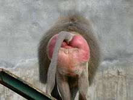

```{r, echo = FALSE}
knitr::opts_chunk$set(
  collapse = TRUE,
  comment = "#>",
  fig.path = "plots/README-"
)
```

The `ramboseli` package aims to provide a set of small functions and utilities for R that can be shared among members of the Amboseli Baboon Research Project. Currently it's just a barebones proof-of-concept, but this documentation will grow as features are added to the package.

## Preparation

To use this package, you first need to install the `devtools` package:

```{r, eval = FALSE}
    install.packages("devtools")
```

Then, you can install the latest development version of `ramboseli` from github:

```{r, eval = FALSE}
  devtools::install_github("amboseli/ramboseli")
```

After you have installed the package once, you can simply load it in the future using:

```{r, message = FALSE, warning = FALSE} 
  library(ramboseli)
```


## A custom color palette
Emily and Emily and I talked about how it would be neat to create a custom color palette for plots that is based on dominant hues in photos from Amboseli. I created one such palette based on the photo below, and I added some functions to this package so that you can use it in an R plot.

<br>
<sub><sup>Photo by [Sergey Pesterev](https://unsplash.com/photos/DWXR-nAbxCk?utm_source=unsplash&utm_medium=referral&utm_content=creditCopyText)</sup></sub>

By default, there are 11 colors:
```{r palette-full, fig.height=3, fig.width=6}
make_palette("div_earthsky")
```

It's called `div_earthsky` because it's a *diverging* color palette, which is useful when both low and high values are interesting and there is a meaningful, well-defined midpoint in the data. You can make make smaller palettes like this:
```{r palette-small, fig.height=3, fig.width=6}
make_palette("div_earthsky", 5)
```

If you need more than 11 colors, you can use a continuous palette to interpolate between the existing colors:
```{r palette-continuous, fig.height=4, fig.width=6}
pal <- make_palette(name = "div_earthsky", n = 100, type = "continuous")
image(volcano, col = pal)
```


There's also a sequential color palette called `seq_swelling` based on this photo:

<br>
```{r palette-swelling-full, fig.height=3, fig.width=6}
make_palette("seq_swelling")
```


